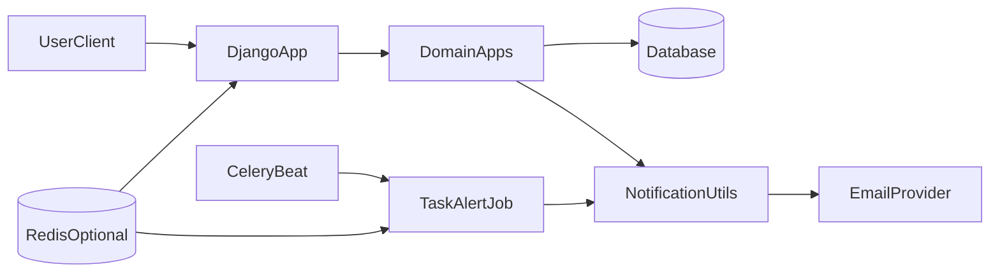

# Backend Architecture

## System Overview

WebPlant is a single Django project (`WebPlant`) composed of domain-focused apps. Most backend logic is implemented in app-level `views.py`, `forms.py`, and `utils.py`, with shared helpers in `base_utils.py`.

Key runtime components:

- Django web app (routing, auth, request handling)
- Relational database (`DATABASE_URL`, SQLite fallback in debug)
- Optional Redis (`REDIS_URL`) for cache, Celery broker/backend, and rate-limit support
- Celery + django-celery-beat for scheduled async tasks
- Cloudinary storage for uploaded files
- Email delivery via console (debug) or Anymail/Resend (production)

## App Responsibilities

- `home`: landing page routes
- `accounts`: custom user model, user preferences, account actions, allauth adapter/signals
- `workspace`: workspace lifecycle, membership, invites, workspace preferences
- `workspace_role`: workspace role definitions and permission checks
- `project`: project-level operations inside a workspace
- `group`: project group management and ordering
- `task`: task operations, comments, attachments, reminders
- `notification`: in-app notifications, email helpers, temporary mute windows
- `feedback`: user feedback submission and storage

## Routing Layout

`WebPlant/urls.py` mounts app URLs under stable prefixes:

- `/account/`, `/workspace/`, `/workspace-role/`
- `/project/`, `/group/`, `/task/`
- `/notification/`, `/feedback/`, and `/` (home)

Admin URL can be secret-suffixed when `URL_SECRET` is set.

## Request and Permission Flow

Most mutable endpoints are authenticated and workspace-scoped.

1. Request enters Django middleware and URL router.
2. View resolves target object(s) through app utils (`get_workspace`, `get_project`, `get_group`, `get_task`).
3. Membership is enforced through `WorkspaceUser` (active membership required).
4. Role checks use `verify_workspace_role(...)` for permission booleans.
5. Owners bypass role checks inside workspace permission verification.
6. Mutations are often performed through form helpers (`reusable_form_submission`).

## Async and Notification Flow

- Celery beat runs `task.tasks.send_task_alert` on a schedule.
- Due `TaskReminder` rows trigger email sends through `notification.utils.send_email`.
- `send_email` can both persist `Notification` rows and send outbound email.
- Email sending is preference-aware and rate-limited.

## High-Level Component Diagram

