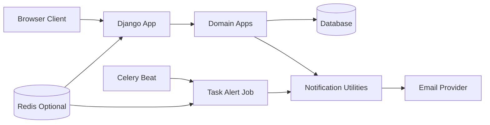

# Backend Architecture

## System Overview

WebPlant is a single Django project (`WebPlant`) split into domain-oriented apps.  
Most business logic lives in app-level `views.py`, `forms.py`, and `utils.py`, with shared primitives in `base_utils.py`.

Primary runtime components:

- Django request/response stack (routing, templates, authentication, sessions)
- Relational database from `DATABASE_URL` (SQLite fallback in debug mode)
- Optional Redis (`REDIS_URL`) for cache, Celery broker/backend, and ratelimit support
- Celery + `django-celery-beat` for periodic task reminders
- Cloudinary-backed media storage when `CLOUDINARY_URL` is provided
- Email backend: console in debug, Anymail/Resend in production
- Sentry SDK for observability

## App Responsibilities

- `home`: root pages and landing routes
- `accounts`: custom user model, user preferences, allauth adapter integration
- `workspace`: workspaces, membership, invite codes, roles, and workspace preferences
- `project`: workspace projects
- `group`: project groups and positional ordering
- `task`: tasks, task comments, attachments, reminders, reminder job
- `notification`: in-app notifications and temporary mute durations
- `feedback`: user feedback collection

## URL Topology

`WebPlant/urls.py` mounts app routes under stable prefixes:

- `/` (home)
- `/account/`
- `/workspace/`
- `/project/`
- `/group/`
- `/task/`
- `/notification/`
- `/feedback/`

Operational routes:

- `/admin/` (or secret-suffixed when `URL_SECRET` is set)
- `/trigger-error/` (or secret-suffixed), useful for testing error monitoring

## Request Lifecycle (Mutable Workspace Actions)

1. A request enters middleware and resolves through Django URL routing.
2. The view loads domain objects via helper functions (`get_workspace`, `get_project`, `get_group`, `get_task`).
3. Membership is validated through `WorkspaceUser` and active state checks.
4. Role permissions are checked using workspace role booleans (owner logic bypasses role restrictions where appropriate).
5. Mutations are typically validated and persisted through forms, often wrapped by `reusable_form_submission(...)`.
6. Responses are returned as rendered templates or JSON for AJAX-style actions.

## Background Processing and Notifications

- `CELERY_BEAT_SCHEDULE` triggers `task.tasks.send_task_alert` every 5 minutes.
- The alert task selects due `TaskReminder` records.
- Email sending is routed through notification utilities and respects user/workspace notification settings.
- Notification operations can write in-app `Notification` records and optionally send external email.

## High-Level Component Diagram

