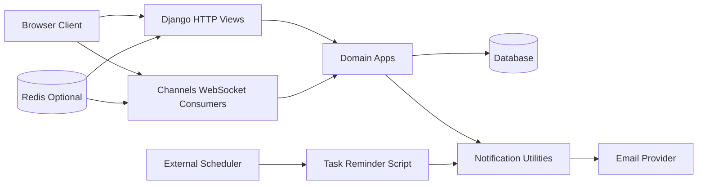

# Backend Architecture

## System Overview

WebPlant is a single Django project package (`WebPlant`) with domain apps at the repository root.
The backend follows a layered, app-local structure:

- **Views** orchestrate request flow, access checks, and response shape.
- **Forms** own validation and object persistence for write operations.
- **Utils** provide app-specific lookups, authorization helpers, and duplication logic.
- **Models** enforce relational constraints and domain invariants.
- **Shared helpers** in `base_utils.py` provide reusable request/form patterns.

Primary runtime components:

- Django request/response stack (routing, templates, auth, sessions)
- Django Channels over ASGI (`daphne`) for realtime update broadcasts
- Optional Redis (`REDIS_URL`) for cache, channel layer, and ratelimit support
- Relational database from `DATABASE_URL` (SQLite fallback in debug mode)
- Cloudinary-backed media storage when `CLOUDINARY_URL` is provided
- Email backend: console in debug, Anymail/Resend in production
- Sentry SDK for error and performance telemetry

## App Responsibilities

- `home`: landing routes
- `accounts`: custom user model, account settings, and preference updates
- `workspace`: workspace membership, role model, invite codes, ownership transfer, audit log model
- `project`: project CRUD and duplication orchestration
- `group`: group CRUD, ordering, and duplication
- `task`: task CRUD, attachments, comments, assignees, reminders
- `notification`: notification feed, read state, temporary notification mute windows, email dispatch helpers
- `feedback`: authenticated feedback submission

## URL and Protocol Topology

`WebPlant/urls.py` mounts HTTP routes under:

- `/` (home)
- `/account/`
- `/workspace/`
- `/project/`
- `/group/`
- `/task/`
- `/notification/`
- `/feedback/`

Operational endpoints:

- `/admin/` or `/admin/<URL_SECRET>/`
- `/trigger-error/` or `/trigger-error/<URL_SECRET>/`

WebSocket routing (`WebPlant/routing.py`):

- `/websocket/project/update/<project_id>/`
- `/websocket/group/update/<group_id>/`
- `/websocket/task/update/<task_id>/`

## Write Request Lifecycle (Design Pattern)

Most mutable endpoints follow this pattern:

1. Resolve the target resource with scoped lookup helpers (`get_*_or_404`).
2. Resolve active membership via `WorkspaceUser`.
3. Verify role permissions with `verify_workspace_role(...)` (owner has bypass behavior).
4. Delegate validation/save to a form through `reusable_form_submission(...)`.
5. Return JSON payloads for AJAX clients (`status`, optional `new_object_id`).

This keeps authorization and validation concerns explicit while avoiding repeated boilerplate.

## Audit and Realtime Collaboration

Project, group, and task model mutations can write `WorkspaceLog` entries.
The model `save()`/`delete()` methods accept `workspace_user` to preserve actor context in logs.

Realtime collaboration uses Channels group fan-out:

- Client sends an action marker (`create`/`edit`/`delete`) over WebSocket.
- Consumer relays to a channel-layer group keyed by object ID.
- Connected clients receive a lightweight refresh signal and pull updated data over HTTP.

This separates event signaling from authoritative data reads.

## Reminder and Notification Flow

- Reminders are stored as `TaskReminder`.
- Email and in-app notification behavior is centralized in `notification/utils.py`.
- Delivery respects user-level preference toggles and temporary mute windows.
- Reminder dispatch is currently script-driven (`task/cron_scripts/send_task_reminders.py`) and should be triggered by external scheduling infrastructure.

## High-Level Component Diagram

