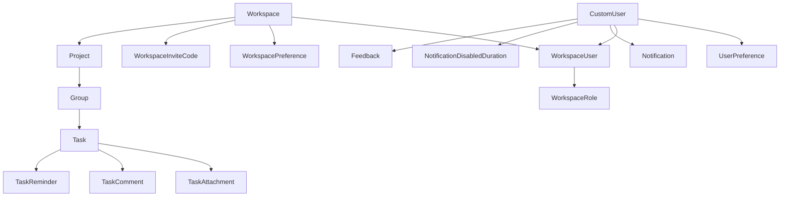

# Domain Model

## Core Entities

WebPlant models collaboration through workspace-scoped membership and nested work objects.

- `CustomUser`: account identity (email-first auth, lowercase username normalization)
- `UserPreference`: per-user UI/notification settings and timezone
- `Workspace`: top-level collaboration boundary
- `WorkspaceUser`: membership join model (user + workspace + role + active status)
- `WorkspaceRole`: workspace-local permission booleans
- `WorkspacePreference`: workspace feature toggles (for example custom role behavior)
- `WorkspaceInviteCode`: invitation token (optional plaintext password)
- `Project`: belongs to one workspace
- `Group`: belongs to one project, ordered by `position`
- `Task`: belongs to one group, ordered by `position`, optional deadline/completion state
- `TaskComment`, `TaskAttachment`, `TaskReminder`: task collaboration artifacts
- `Notification` and `NotificationDisabledDuration`: in-app communication and mute windows
- `Feedback`: user-submitted feedback content

## Relationship Overview

## Access and Authorization Model

- Access is membership-driven (`WorkspaceUser`) instead of direct foreign keys to `CustomUser`.
- Membership uniqueness is enforced per `(workspace, user)`.
- Ownership is workspace-scoped via `Workspace.owner -> WorkspaceUser`.
- Roles are workspace-scoped and unique by `(workspace, role_name)`.
- Permission checks evaluate booleans on `WorkspaceRole`, with owner-aware behavior in permission utilities.

## Ordering and Hierarchy Invariants

- Group order is unique per project via `(project, position)`.
- Task order is unique per group via `(group, position)`.
- Deleting parent entities cascades through nested children for project/group/task structures.

## Communication and Reminder Invariants

- `TaskComment.added_by` references `WorkspaceUser` so audit context stays workspace-specific.
- `TaskReminder` links both a task and a target workspace member (`workspace_user`).
- Notification muting uses one active duration row per user (`OneToOneField`).
- Email delivery and in-app notification persistence are related but not identical operations.

## Security and Data Notes

- `WorkspaceInviteCode.password` is stored unhashed; treat as sensitive temporary data.
- `CustomUser` enforces case-insensitive email uniqueness.
- IDs are UUID primary keys across core domain models.
