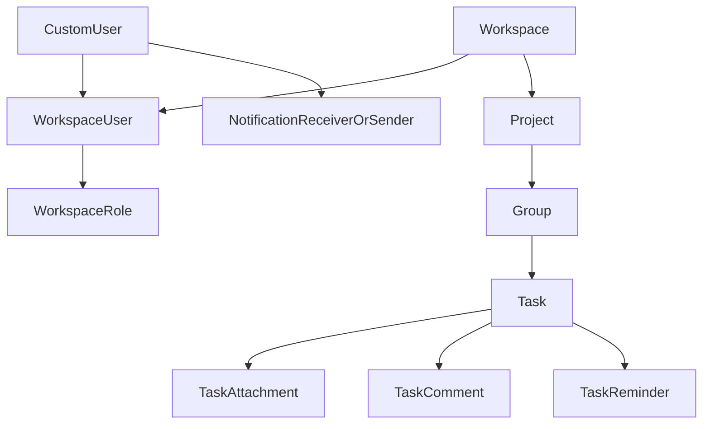

# Domain Model

## Core Concepts

WebPlant models collaboration around workspaces and nested work items.

- A `CustomUser` represents an account.
- A `Workspace` is the top-level collaboration boundary.
- A `WorkspaceUser` links user membership to a workspace and role.
- A `WorkspaceRole` defines permission booleans used for authorization.
- A `Project` belongs to one workspace.
- A `Group` belongs to one project and controls ordering with `position`.
- A `Task` belongs to one group and also uses `position` ordering.

## Relationship Overview

## Collaboration and Access Model

- Membership is represented by `WorkspaceUser`, not just by direct user references.
- `Workspace.owner` points to a `WorkspaceUser`, making ownership workspace-scoped.
- Role permissions are evaluated against booleans on `WorkspaceRole`.
- Permissions are enforced in backend utility functions, with owner bypass support.

## Task and Communication Model

- `TaskComment.added_by` references `WorkspaceUser`, preserving workspace context.
- `TaskAttachment` uses Django file storage (Cloudinary-backed in this project).
- `TaskReminder` drives scheduled reminder emails via Celery.
- `Notification` stores in-app notification history independent of email delivery success.

## Notes Worth Knowing

- Group/task ordering is position-based (`FloatField`) with uniqueness per parent.
- `WorkspaceInviteCode.password` is stored unhashed; treat it as sensitive and temporary.
